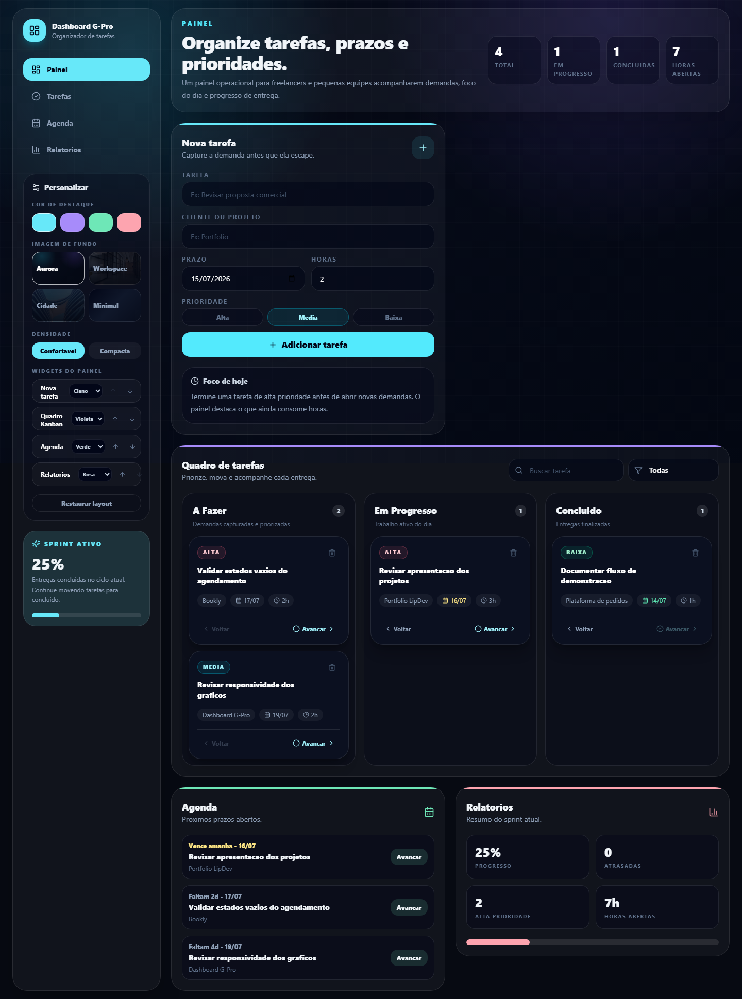
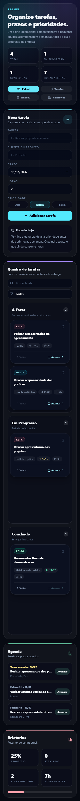

# Dashboard G-Pro

Dashboard demonstrativo para organizar tarefas, prazos e prioridades. A aplicacao funciona sem cadastro e salva os dados localmente no navegador, o que permite avaliar o fluxo completo sem credenciais externas.



## Demonstracao

- quadro Kanban com etapas A Fazer, Em Progresso e Concluido;
- cadastro de tarefas com projeto, prazo, prioridade e estimativa;
- busca e filtro por prioridade;
- agenda ordenada por prazo;
- indicadores de progresso e carga de trabalho;
- personalizacao de cor, fundo, densidade e ordem dos widgets;
- persistencia local com `localStorage`.

Os registros iniciais sao dados ficticios de demonstracao baseados nos projetos publicos do autor. Nenhuma integracao, cliente ou resultado comercial e simulado.

## Tecnologias

- React 18;
- TypeScript;
- Vite;
- Tailwind CSS 4;
- Lucide React;
- Playwright para testes de interface;
- ESLint e GitHub Actions para qualidade continua.

## Executar localmente

Requisitos: Node.js 22 e npm.

```bash
git clone https://github.com/LipDev-sudo/Dashboard-G-Pro.git
cd Dashboard-G-Pro
npm ci
npm run dev
```

Acesse o endereco exibido pelo Vite. Os dados ficam somente no `localStorage` do navegador.

## Verificacoes

```bash
npm run lint
npm run typecheck
npm run build
npx playwright install chromium
npm test
```

O teste Playwright cobre desktop (`1440x900`) e mobile (`390x844`), incluindo persistencia, foco do teclado e overflow horizontal.

## Estrutura ativa

```text
src/
  app/
    components/       Componentes do fluxo de tarefas
    dashboard/        Tipos, dados e regras do dominio
    App.tsx            Orquestracao das telas e preferencias
  main.tsx             Entrada da aplicacao
tests/e2e/             Testes Playwright
```

O repositorio tambem preserva uma arquitetura experimental com Firebase que nao participa do bundle atual. Para habilita-la futuramente, use variaveis `VITE_*` locais e nunca publique credenciais privadas.

Copie `.env.example` para `.env.local` apenas se for trabalhar nessa integracao. O dashboard demonstrativo atual nao depende dessas variaveis.

## Screenshots

| Desktop | Mobile |
| --- | --- |
|  |  |

## Autor

Hamilton Felipe Soares da Silva - [GitHub](https://github.com/LipDev-sudo)

## Licenca

Distribuido sob a licenca descrita em [LICENSE](LICENSE).
