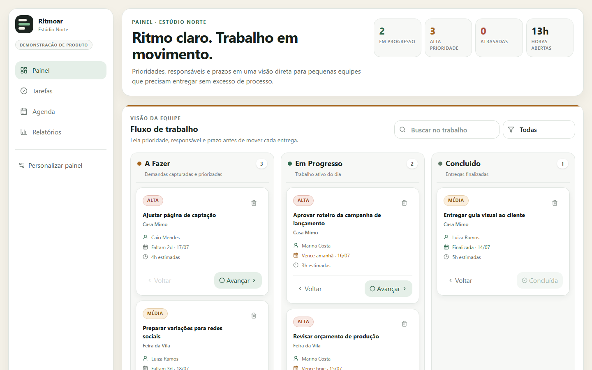
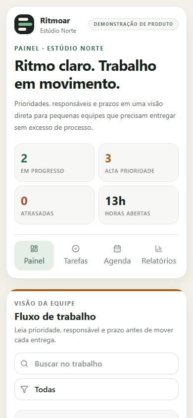

# Ritmoar

**Ritmo claro. Trabalho em movimento.**

Ritmoar é uma demonstração de produto para organizar prioridades, responsáveis e andamento do trabalho com clareza, sem excesso de complexidade. Foi pensada para pequenas equipes, freelancers e agências que precisam enxergar rapidamente o que está a fazer, em progresso, concluído ou em risco.



## Demonstração de produto

O workspace fictício **Estúdio Norte** apresenta um cenário coerente de pequena equipe. Projetos, tarefas, responsáveis e prazos existem apenas para demonstrar a experiência; não representam clientes, métricas ou resultados comerciais reais.

- fluxo de trabalho com etapas A Fazer, Em Progresso e Concluído;
- prioridade, responsável, prazo e estimativa visíveis em cada tarefa;
- criação, busca, filtro, avanço e exclusão de tarefas;
- agenda ordenada por prazo e relatório operacional;
- personalização secundária de densidade, cores e blocos;
- persistência local no navegador, sem cadastro ou serviço externo.

## Direção do produto

A interface usa papel quente apenas no canvas, superfícies brancas e texto grafite. Verde indica trabalho ativo e ações seguras; âmbar destaca atenção; terracota sinaliza alta prioridade e atraso. A tipografia local, as bordas suaves e as sombras discretas mantêm uma aparência SaaS atual sem depender de gradientes, imagens remotas ou fontes externas.

O símbolo tipográfico representa três linhas de trabalho avançando. A marca evita referências a hábitos, música ou Pomodoro e posiciona Ritmoar explicitamente como ferramenta de organização e acompanhamento do trabalho em equipe.

## Tecnologias

- React 18;
- TypeScript;
- Vite;
- Tailwind CSS 4;
- Lucide React;
- Playwright para testes de interface;
- ESLint e GitHub Actions para qualidade contínua.

## Executar localmente

Requisitos: Node.js 22 e npm.

```bash
git clone https://github.com/LipDev-sudo/Dashboard-G-Pro.git
cd Dashboard-G-Pro
npm ci
npm run dev
```

Acesse o endereço exibido pelo Vite. Os dados ficam somente no `localStorage` do navegador. Para restaurar o workspace fictício, use **Personalizar painel → Restaurar padrão**.

## Verificações

```bash
npm run typecheck
npm run lint
npm run build
npm test
```

A suíte Playwright cobre desktop (`1440×900`) e mobile (`390×844`), incluindo identidade, metadata, criação, persistência, busca, filtros, mudança de status, exclusão, preferências, foco de teclado, alvos de toque e ausência de overflow horizontal.

## Estrutura ativa

```text
src/
  app/
    components/       Componentes do fluxo de tarefas
    dashboard/        Tipos, dados e regras do domínio
    App.tsx            Orquestração das telas e preferências
  main.tsx             Entrada da aplicação
tests/e2e/             Testes Playwright
```

O repositório preserva uma arquitetura experimental com Firebase que não participa do bundle ativo. Ela não é necessária para a demonstração Ritmoar. Caso seja explorada futuramente, use variáveis `VITE_*` locais e nunca publique credenciais privadas.

Copie `.env.example` para `.env.local` somente ao trabalhar nessa integração. O modo demonstrativo atual não depende de variáveis de ambiente.

## Screenshots

| Desktop | Mobile |
| --- | --- |
|  |  |

## Autor

Hamilton Felipe Soares da Silva — [GitHub](https://github.com/LipDev-sudo)

## Licença

Distribuído sob a licença descrita em [LICENSE](LICENSE).
